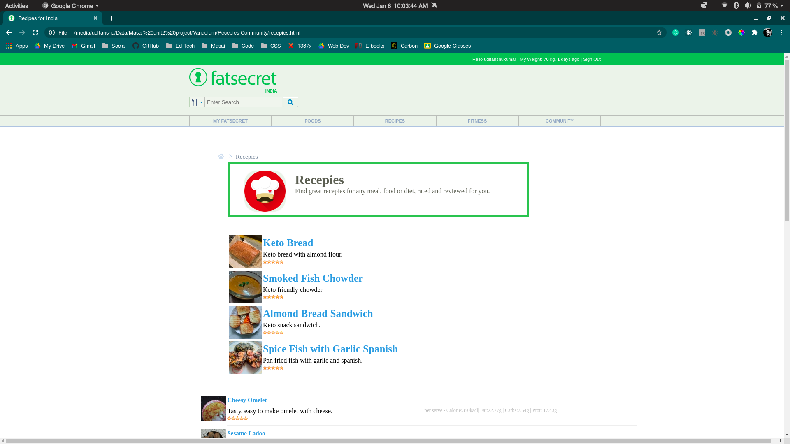
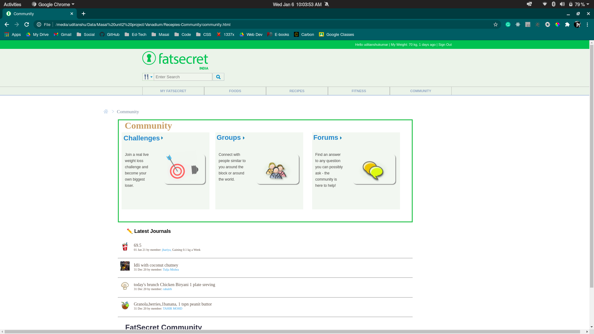

# Team Vanadium

## Project Title :- fatSecret.com

#### FatSecret is a mobile application, website and API that lets users track their nutrition, exercise and weight. Find great meal ideas, diet tools, community support and more as you discover a world of healthy eating at fatsecret.com.

## <b>Getting Started with --</b> 

###### After cloning the repo, open the <i>"Home_page/fat_secret.html"</i> file. It is the <b>principal page/feed page</b> of the site. The header section of the page contains a horizontal bar with different options to get on to different pages.

******Taking one option at a time from the Upper bar**********

<i><b>1. Click on <i>"MY FATSECRET"</i> button from the upper bar</b></i> 

<ul>
<li>This segment contains all the stories that are posted by different users. On the right side of the main page, there are many options attached to it.</li>   
<li>All the options on the right side are not active, only few main options are in working mode.
  <ol>
    Those are:
      <li>
        <b>My Fatsecret</b> : On Clicking over it, all the feeds posted till now appears. 
        <i>Note: It may happen that sometime support and comment section of the posts might not work. To handle those conditions, just click on My Fatsecret button on the right side and it will get resolved.</i>
     </li>
      <li>
        <b>Food</b>: This is for adding one's daily diet to the food diary. 
      </li>
      <li>
        <b>Exercise</b>: This is for adding one's daily activities and exercise to the exercise diary.
      </li>
      <li>
        <b>Journal</b>: This option is used for posting a story in the feed page. Upon clicking over this, a popup appears on the center of the page. There one can write
        description about that post and add image url to it and by clicking on submit button one can submit that post to the feed page.
      </li>
      <li>
        <b>View My Member Page</b>: It contains description about that particular person. It is somewhat like a profile page.   
      </li>
  </ol>
</li>
<li> That's all about "MY FATSECRET" section...moving on to the next one...
</ul>
  

  
<i><b>2. Click on <i>"FOODS"</i> button from the upper bar</b></i> 

<ul>
<li>This page contains micro-level details about each and every types of food required for a fit and healthy body.</li>
<li>To see the in-depth description about any particular food, just click over it.</li>
<li> That's all about "FOODS" section...moving on to the next one...</li>
</ul>
  

  
<i><b>3. Click on <i>"RECIPES"</i> button from the upper bar</b></i> 

<ul>
<li>This page contains description about, how to cook any particular recipe. Just click over any recepie to see the process to cook and any details about ingredients.</li>
<li> That's all about "RECIPES" section...moving on to the next one...</li>
</ul>
  

  
<i><b>4. Click on <i>"COMMUNITY"</i> button from the upper bar</b></i> 

<ul>
<li>This page displays the name of members currently active.</li>
<li>To see the details about any user, just click over his/her name. Upon clicking over any name, the user will be diverted to his/her profile.</li>
<li> That's all about "COMMUNITY" section....</li>
</ul>
  

## That's all, Thank u for giving it a read................
